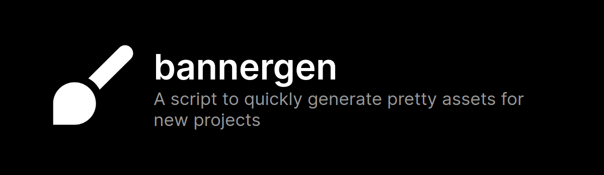

    

## Usage

Install packages, build with `npm run build`, then run `npm start`.

## Creating new templates

Add your templates as `html` files under [the banners folder](./banners/). Define variables with a `define` tag. 

## Licensing

Code is licensed under Unlicense, while all assets found in [presets](./presets/) are owned by their respective copyright holders, and therefore have their own licenses. Though the only ones that really matter are just profile pictures and i don't think companies will gaf lol (don't take this as legal advice though)